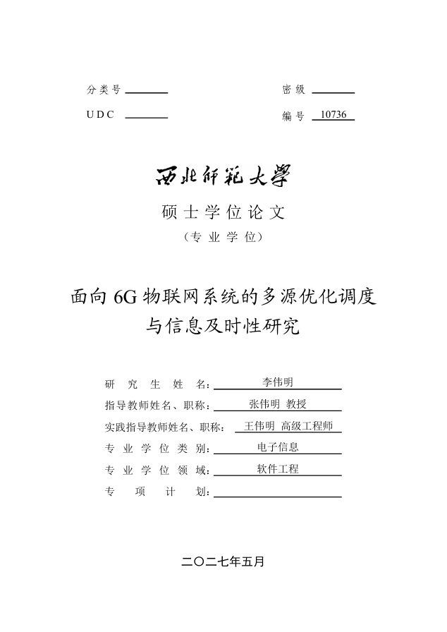

<p align="center">
  
</p>

<h1 align="center">
硕士学位论文
</h1>

> [!WARNING]
> 本模板仍然在开发中，欢迎贡献本项目。

本 Typst 模板适用于西北师范大学硕士研究生学位论文。在开始之前，你需要先
[学习了解 Typst](https://typst.app/docs/) ，或者你可以参考
[中文教程](https://typst-doc-cn.github.io/guide/) 。

<p align="center">
  
</p>

## 模板背景

编写本模板的原因，是笔者同样无法忍受 $\LaTeX$ 繁冗复杂的语法了！

$\LaTeX$的编译速度也出奇地慢，笔者试过学校提供的 $\LaTeX$ 模板，文档超过30页，编译时间居然要2分钟，这对于喜欢边写边预览的我来说是不可忍受的。另外 $\LaTeX$ 在文档编译时，经常会出现语焉不详的报错信息，产生大量奇怪的副文件、中间文件，经常把目录搞得一团糟。在笔者看来，$\LaTeX$就像是落后于两个世纪的、一台笨重的古董蒸汽机。

Typst 作为新兴的排版程序，其设计思想、程序语言都非常现代化，且性能优秀，对于大文档也是即时编译，有非常不错的性能。

## 安装配置

本工程构建脚本需要 GNU Make 工具。如果你在 Windows 平台上，请先在安装并配置 GNU Make 工具。

```bash
choco install make
```

安装完后在本目录下用命令行检查 make 是否正常工作

```bash
make ping # 预期输出： "Pong"
```

首先确保你在本机[安装了 Typst 软件并配置环境](https://github.com/typst/typst?tab=readme-ov-file#installation)
。推荐使用 Visual Studio Code 作为编辑器。

然后，请安装 [typstyle](https://github.com/Enter-tainer/typstyle) ，它是用于 Typst 代码的文本格式化工具。

接下来安装本论文必需的字体文件。为方便使用，所需字体已储存在本仓库下的
`./assets/font` 目录下。本论文涉及的字体列表如下：

- 宋体（中易宋体，SimSun）
- 黑体（中易黑体，SimHei）
- Times New Roman
- 楷体 GB2312
- 仿宋 GB2312

可以执行安装字体的命令，一键安装所有必需字体。

```bash
make install-fonts
```

如果希望在编辑时动态预览文档，可执行 

```bash
make watch
```

如果需要格式化文档，请执行

```bash
make fmt
```

若编译文档，可以执行

```bash
make compile
```

## 项目结构

本论文的内容均在 `contents` 目录下的各个 `*.typ` 文件中，可根据文件内的注释提示编写代码。

+ `cover.typ`: 封面内容。
+ `abstracts/*.typ`: 中文和英文摘要内容。
+ `statements/*.typ`: 论文的声明部分。
+ `mainmatter/chapter-*/`: 每个章节都放在 `content.typ` 中，插图也可以放在该目录下。
+ `appendixes/appendix-*/`: 每个附录都放在 `content.typ` 中，插图也可以放在该目录下。
+ `conclusion.typ`: 结论内容。
+ `references/ref.bib`: 参考文献内容，这部分内容使用 BibTeX 编写。
+ `acknowledgement.typ`: 致谢内容。

## 参考标准

本项目参考西北师范大学的研究生学位论文 [撰写格式及印制规格的规定](https://glxy.nwnu.edu.cn/_upload/article/files/6d/87/e60340204267b297279da98ee812/2de72e0e-fe20-4af8-9c8f-ffc6ee839595.pdf) 编写。并参考了西北师范大学计算机科学与工程学院的 [论文 LaTeX 模板样例](https://jsj.nwnu.edu.cn/_upload/article/files/eb/c1/e3afc0a744c3a476a36ca4b6e892/5f4f9570-49bc-4012-9d54-4765603a1f5b.zip)

## 协议
本 Typst 模板
**非官方模板**，虽已可能按论文格式标准完整复现模板。但仍可能存在部分误差。**用户对使用本模板自负。**

除部分涉及学校单位相关的资源（如西北师范大学文字 LOGO、字体等），本项目其余部分以 MIT 协议开源。

PS：如果你喜欢本模板，不妨把我和本项目添加到你的论文致谢中吧 😋~
